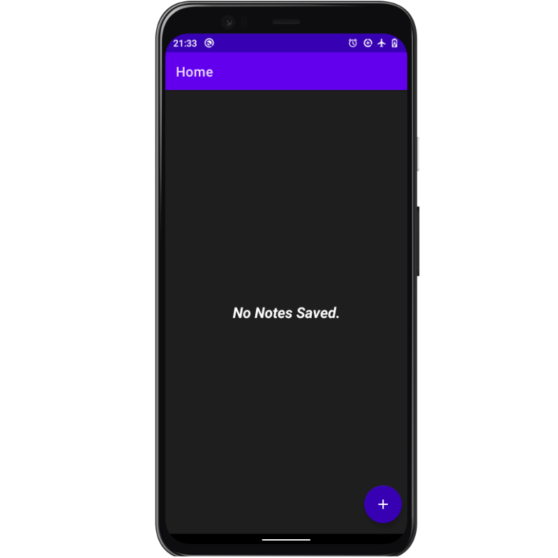
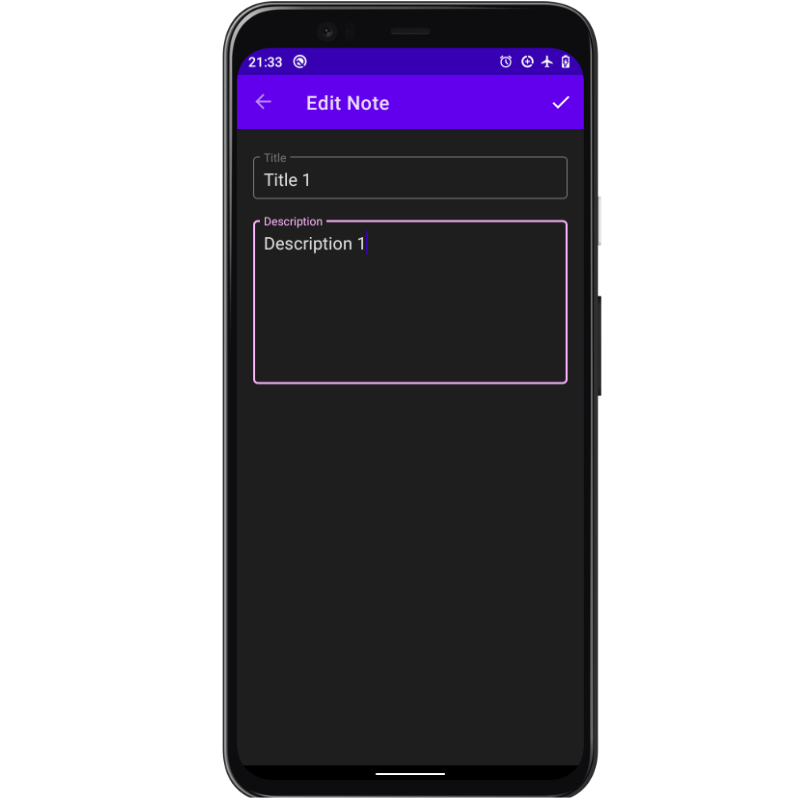
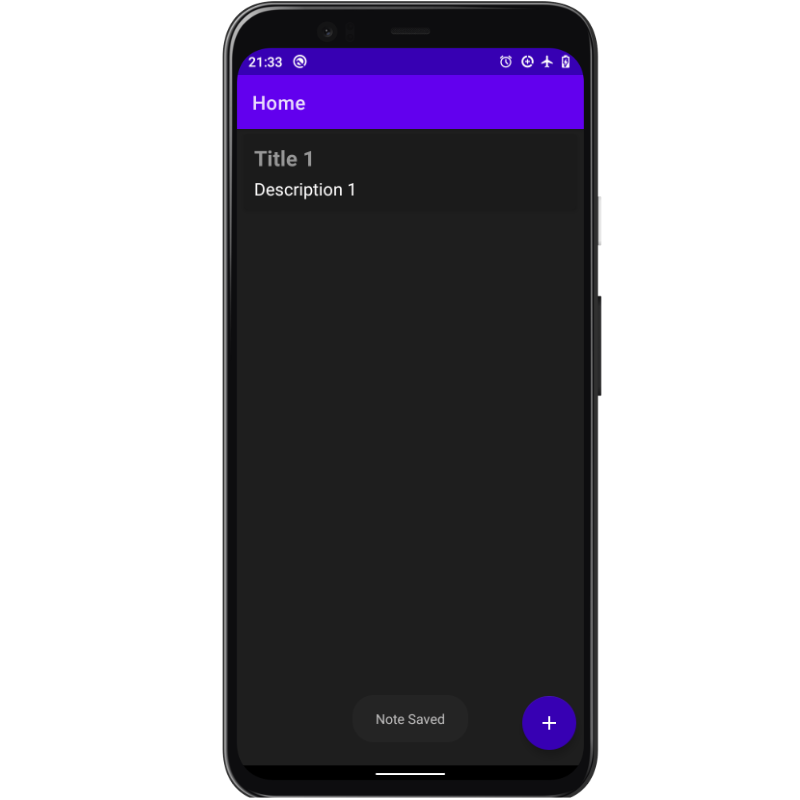
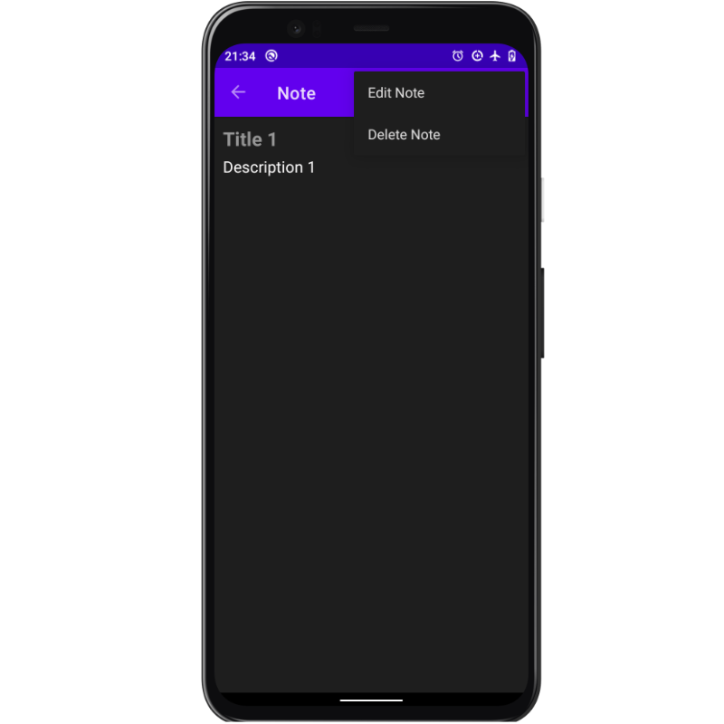

# NoteIt
An android app to demonstrate using Room Jetpack component to make a simple notebook app. It has been built using MVVM architecture pattern.

Min Api Level: 21 [Supports Over 90% Devices](https://developer.android.com/about/dashboards)

Build System : [Gradle](https://gradle.org/)

## Table of content.

- [App Screenshots](#appscreenshots)
- [Introduction](#introduction)
- [Getting started](#gettingstarted)

## App Screenshots.

<p align="center">
    
    
    
    
</p>


## Introduction.
Room provides an abstraction layer over SQLite to allow fluent database access while harnessing the full power of SQLite.

The most common use case of Room is cacheing data from a network source which can then be accessed when the device is offline or even when the device is online but in order to reduce network usage.

Room has three main components:
- Entity: Represents the tables within the database.
- Data Access Objects: Represents the database querry to access data in the database.
- Database: Acts as the main access point for the underlying connection to your app's persisted, relational data.


## Getting Started.
Start by setting up databinding and the dependencies for the project

 ### In the project-level gradle 
 ``` gradle
    dependencies {
        claspath...

        //Add this to use safe-args
        classpath "androidx.navigation:navigation-safe-args-gradle-plugin:2.3.0"
    }
```

### In the app-level gradle

``` gradle
apply plugin: 'kotlin-kapt'
apply plugin: 'androidx.navigation.safeargs.kotlin'


android{
    ...

//Add this to enable databindg
     buildFeatures {
        dataBinding = true
    }

}

dependencies {
    //Dependencies version
    def room_version = "2.2.5"
    def lifecycle_version = "2.2.0"
    def nav_version = "2.3.0"
    def coroutine_version = "1.3.7"

    //Other dependenceis...

    //Kotlin coroutine
    implementation "org.jetbrains.kotlinx:kotlinx-coroutines-core:$coroutine_version"
    implementation "org.jetbrains.kotlinx:kotlinx-coroutines-android:$coroutine_version"

    //Room
    implementation "androidx.room:room-runtime:$room_version"
    kapt "androidx.room:room-compiler:$room_version"
    //Room coroutine
    implementation "androidx.room:room-ktx:$room_version"

    // ViewModel
    implementation "androidx.lifecycle:lifecycle-viewmodel-ktx:$lifecycle_version"
    // LiveData
    implementation "androidx.lifecycle:lifecycle-livedata-ktx:$lifecycle_version"

    // Navigation
    implementation "androidx.navigation:navigation-fragment-ktx:$nav_version"
    implementation "androidx.navigation:navigation-ui-ktx:$nav_version"
    implementation "androidx.navigation:navigation-fragment:$nav_version"
    implementation "androidx.navigation:navigation-ui:$nav_version"
}
```

```
NB: After adding the above dependences disable offline syncing and sync the project.
```

## App structure.
Since the app uses MVVM architecture we'll first write the code for room i.e. entity, dao and database then the repository then the viewmodel and finally the UI layer.

## Room.
### Entity.
The entity represents the table that will be stored in the app database. It is used to set and get the value of the database table. Since we are making a simple notebook app it will only contain the note id which will be the primary key, the note title and the note description.

The entity is annotated with the @Entity annotation and we set the table name in this class.

```Kotlin
@Entity(tableName = "note_table")
data class Note(
    @PrimaryKey(autoGenerate = true)
    val id: Int,
    val title: String,
    val description: String
)
```


### Data Access Object (DAO).
The DAO is used to write the methods/querry to interact with the database. The class is annotated with the @DAO annotation.

The database querry are in form of annotations e.g. @Insert, @Update, @Delete or custom querries using @Querry("your custom sqlite querry")

```Kotlin
@Dao
interface NoteDao {

    //Insert or update a note into the database
    @Insert(onConflict = OnConflictStrategy.REPLACE)
    suspend fun upsert(note: Note)

    //Delete note from the database
    @Delete
    suspend fun delete(note: Note)

    //Get all notes that are in the database and order them using their ids in a descending order(newest first).
    @Query("SELECT * FROM note_table ORDER BY id DESC")
    suspend fun getAllNotes(): List<Note>

}
```

``` 
NB: Database operations are resource intensive thus the need to perform asynchronous processing hence the use of Coroutines using suspend functions.
```

### Database.
The database contains the database holder and serves as the main access point for the underlying connection to your app's persisted, relational data. The class is annotated with @Database and should have an array of room entities and database version.

```kotlin
@Database(entities = [Note::class], version = 1)
abstract class AppDatabase : RoomDatabase() {

    abstract val noteDao: NoteDao

    companion object {
        @Volatile
        private var INSTANCE: AppDatabase? = null

        operator fun invoke(context: Context): AppDatabase {
            synchronized(this) {
                var instance = INSTANCE

                if (instance == null) {
                    instance = Room.databaseBuilder(
                        context.applicationContext,
                        AppDatabase::class.java,
                        "note_database" //Database name
                    ).build()
                }
                return instance
            }
        }
    }
}
```

## Repository.

```kotlin
class NoteRepository(private val db: AppDatabase) {

    suspend fun upsertNote(note: Note) {
        db.noteDao.upsert(note)
    }

    suspend fun deleteNote(note: Note) {
        db.noteDao.delete(note)
    }

    suspend fun getAllNotes() = db.noteDao.getAllNotes()
}
```
# StateListener.
Create a new interface class that will listen to the change of various states.

```kotlin
interface StateListener {

    fun onStarted()

    fun onSuccess(message: String)

    fun onFailure(message: String)

}
```

## ViewModel.

```kotlin
class NoteViewModel(private val noteRepository: NoteRepository) : ViewModel(), Observable {

    @Bindable
    val title = MutableLiveData<String>()

    @Bindable
    val description = MutableLiveData<String>()

    var StateListener: StateListener? = null

    //Function to save a note
    fun saveNote() = viewModelScope.launch {
        StateListener?.onStarted()

        //Check if the editext is empty.
        if (title.value.isNullOrEmpty()) {
            StateListener?.onFailure("Enter note title!")
            return@launch
        } else if (description.value.isNullOrEmpty()) {
            StateListener?.onFailure("Enter note description!")
            return@launch
        }

        try {
            noteRepository.upsertNote(Note(0, title.value!!, description.value!!))
            StateListener?.onSuccess("Note Saved")
            return@launch
        } catch (e: Exception) {
            StateListener?.onFailure("Error: $e")
        }
    }

    //Returns livedata of all values in the database
    val allNotes = liveData(Dispatchers.IO) {
        StateListener?.onStarted()
        val notes = noteRepository.getAllNotes()
        emit(notes)
    }

    //Deletes a specific note.
    fun deleteNote(note: Note) = viewModelScope.launch {
        noteRepository.deleteNote(note)
    }


    override fun removeOnPropertyChangedCallback(callback: Observable.OnPropertyChangedCallback?) {}
    override fun addOnPropertyChangedCallback(callback: Observable.OnPropertyChangedCallback?) {}

}
```

## NoteViewModel.
```kotlin
@Suppress("UNCHECKED_CAST")
class NoteViewModeFactory(
    private val noteRepository: NoteRepository
) : ViewModelProvider.NewInstanceFactory() {

    override fun <T : ViewModel?> create(modelClass: Class<T>): T {
        return NoteViewModel(noteRepository) as T
    }
    
}
```
